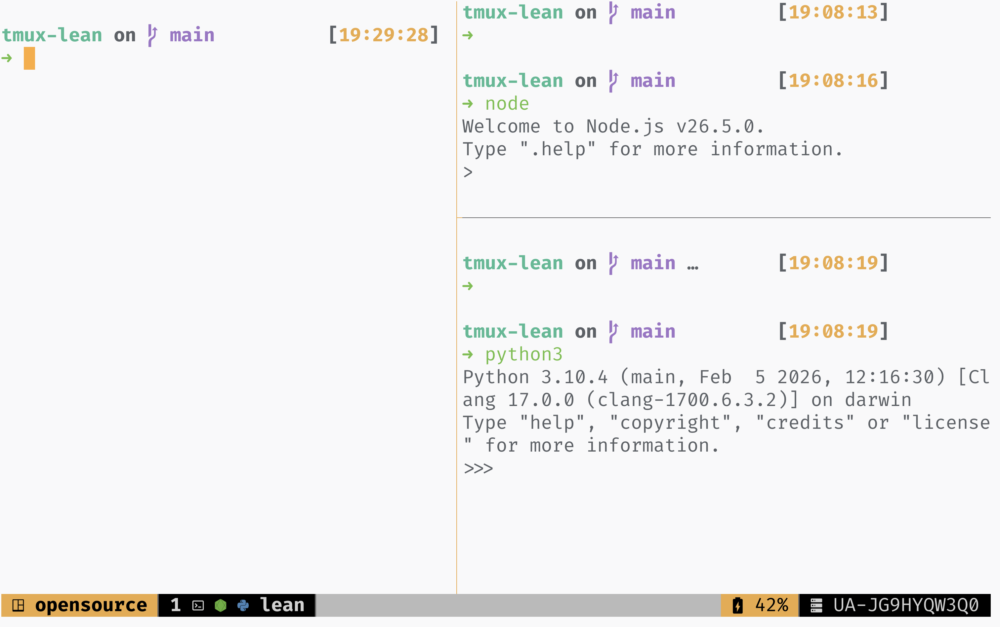

# tmux-lean

<picture>
  <source media="(prefers-color-scheme: dark)" srcset="assets/screenshot-dark.png">
  <source media="(prefers-color-scheme: light)" srcset="assets/screenshot-light.png">
  
</picture>

## Features

- Automatic light/dark colors from your terminal.
- Window numbers, names, and an icon for every pane.
- Brand-colored icons in the active window.
- Battery level and charging indicator, plus hostname.
- Editable [theme colors](src/theme.conf) and [process icons](src/processes.conf).

## Installation

Requires **tmux 3.6+**, a **Nerd Font**, and [TPM](https://github.com/tmux-plugins/tpm).

> [!NOTE]
> Battery display hides when macOS `pmset` is missing or reports no battery.
> Light/dark switching requires a terminal that reports its theme.

Add to `tmux.conf` before TPM initialization (and before `tmux-continuum`, if used):

```tmux
set -g @plugin 'denysdovhan/tmux-lean'
```

Press **prefix + I** to install.

## License

MIT © [Denys Dovhan](https://denysdovhan.com)
